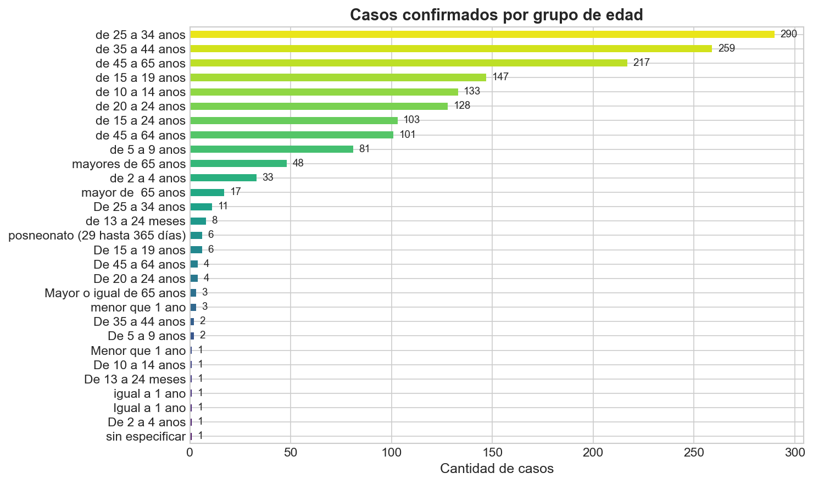

# 🦟 Dengue en Argentina: Análisis Exploratorio de Datos (2018–2025)

> *Quality Eye, Data Mind* — Análisis de datos públicos de salud con enfoque en calidad y storytelling.


---

## 📋 Descripción

¿Cómo se comporta el dengue en Argentina? ¿Cuáles son las provincias más afectadas? ¿Existe un patrón estacional claro? ¿El brote de 2024 fue realmente histórico?

Este proyecto realiza un **Análisis Exploratorio de Datos (EDA)** sobre los casos confirmados de dengue y Zika registrados por el Ministerio de Salud de la Nación Argentina entre 2018 y 2025, buscando responder estas preguntas a través de datos, estadísticas descriptivas y visualizaciones.

### Preguntas de investigación

- 📈 ¿Cómo evolucionó la cantidad de casos confirmados año a año?
- 🗺️ ¿Qué jurisdicciones concentran la mayor cantidad de casos?
- 📅 ¿En qué semanas epidemiológicas se producen los picos?
- 🔄 ¿Existen patrones estacionales recurrentes?
- ⚖️ ¿Qué proporción representan los casos de Zika respecto al dengue?

---

## 🔍 Hallazgos principales

> ⚠️ *Esta sección se completará a medida que avance el análisis.*




<!-- 
Ejemplo de cómo incluir una visualización destacada:

-->

---

## 📁 Estructura del proyecto

```
dengue-argentina-eda/
├── README.md                          # Este archivo
├── requirements.txt                   # Dependencias del proyecto
├── .gitignore                         # Archivos excluidos de Git
├── LICENSE                            # Licencia MIT
├── data/
│   ├── raw/                           # Datos originales (CSV descargados)
│   └── processed/                     # Datos limpios listos para análisis
├── notebooks/
│   ├── 01_carga_y_limpieza.ipynb      # Carga, inspección y limpieza de datos
│   ├── 02_eda_descriptivo.ipynb       # Análisis exploratorio y estadísticas
│   └── 03_visualizaciones.ipynb       # Visualizaciones y storytelling
├── src/
│   └── utils.py                       # Funciones reutilizables
└── outputs/
    └── figures/                       # Gráficos exportados (PNG)
```

---

## 📊 Fuente de datos

| Campo | Detalle |
|-------|---------|
| **Fuente** | [Portal de Datos Abiertos - Ministerio de Salud](https://datos.salud.gob.ar/dataset/vigilancia-de-dengue-y-zika) |
| **Dataset** | Vigilancia de las enfermedades por virus del Dengue y Zika |
| **Formato** | CSV |
| **Período** | 2018 – 2025 |
| **Actualización** | Semanal |
| **Licencia** | Creative Commons Attribution 4.0 |

---

## 🚀 Cómo reproducir este análisis

### 1. Clonar el repositorio

```bash
git clone https://github.com/Grisel86/dengue-argentina-eda.git
cd dengue-argentina-eda
```

### 2. Crear entorno virtual e instalar dependencias

```bash
python -m venv venv
source venv/bin/activate  # En Windows: venv\Scripts\activate
pip install -r requirements.txt
```

### 3. Descargar los datos

Descargá los archivos CSV desde el [portal de datos abiertos de salud](https://datos.salud.gob.ar/dataset/vigilancia-de-dengue-y-zika) y colocalos en la carpeta `data/raw/`.

### 4. Ejecutar los notebooks

```bash
jupyter notebook notebooks/
```

Ejecutar en orden: `01_carga_y_limpieza.ipynb` → `02_eda_descriptivo.ipynb` → `03_visualizaciones.ipynb`

---

## 🛠️ Tecnologías

- **Python 3.10+**
- **Pandas** — Manipulación y limpieza de datos
- **Matplotlib & Seaborn** — Visualizaciones estáticas
- **Jupyter Notebook** — Desarrollo interactivo y documentación
- **NumPy** — Operaciones numéricas

---

## 🔗 Enfoque QA aplicado a datos

Como profesional de QA Automation en transición a Data Science, este proyecto aplica principios de aseguramiento de calidad al análisis de datos:

- **Validación de integridad:** Inspección sistemática de nulls, duplicados y tipos de datos
- **Documentación de defectos:** Cada problema en los datos se documenta como un hallazgo con su resolución
- **Trazabilidad:** Pipeline reproducible desde datos crudos hasta visualizaciones finales
- **Testing de supuestos:** Verificación de hipótesis antes de sacar conclusiones

---

## 👩‍💻 Autora

**Fabiana Grisel González**
Data Quality Engineer | Estudiante de Ciencia de Datos @ UNDEC

[](https://www.linkedin.com/in/fabiana-grisel-gonzalez)
[](https://github.com/Grisel86)

---

## 📄 Licencia

Este proyecto está bajo la licencia MIT. Ver el archivo [LICENSE](LICENSE) para más detalles.

Los datos utilizados son de dominio público bajo licencia Creative Commons Attribution 4.0, publicados por el Ministerio de Salud de la Nación Argentina.
